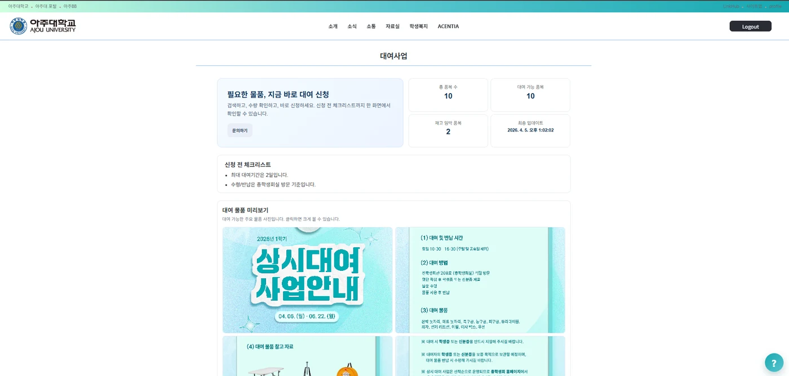
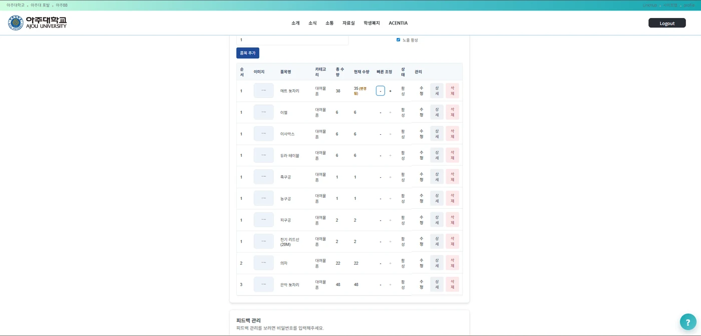
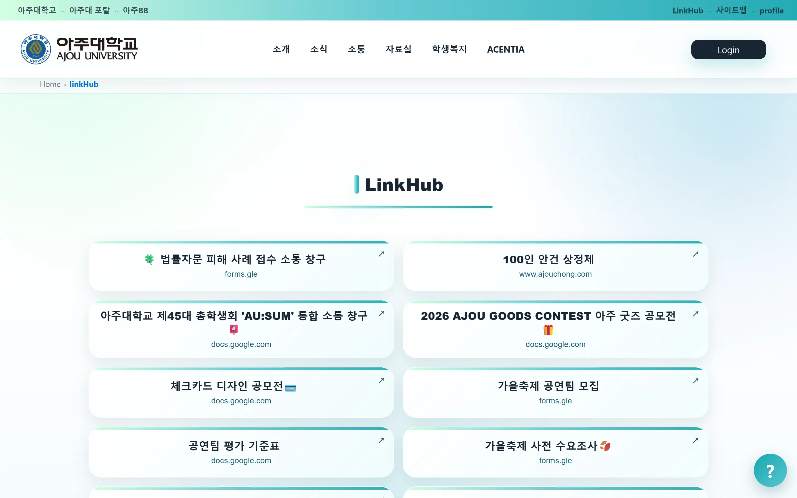
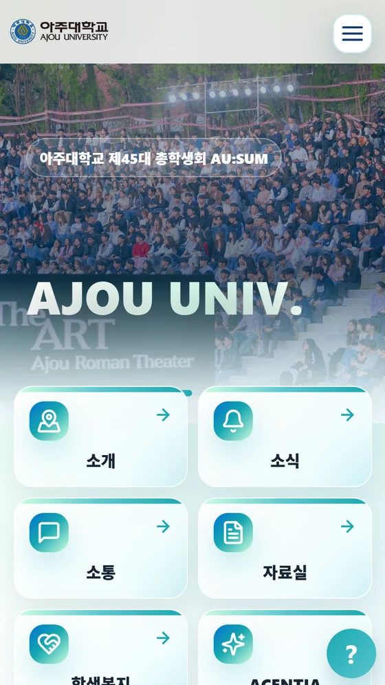
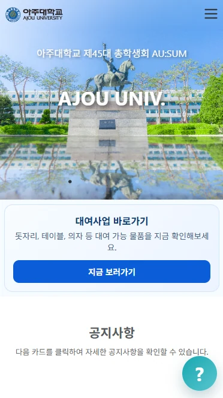

# 아주대학교 총학생회 웹 (ajouchong.com)

공지·Q&A·자료실·대여사업·제휴복지를 한 사이트로 모은 아주대학교 총학생회 공식 홈페이지의 프론트엔드다. 학생이 학생회관까지 오지 않고도 남은 대여 물품을 확인하고, 총학생회는 개발자를 부르지 않고 수량·링크·공지를 직접 고친다. 지금 운영 중이다.


| | |
|---|---|
| 기간 | 2024.12 ~ 진행 중 (첫 커밋 2024-12-03 · `develop` 345 커밋) |
| 인원 | 3명 — 정재훈(`toadsam`) 몫은 커밋 38개. 2025 화면 일부, 2026 UI 전면 개편과 관리자 화면 6종, 백엔드 대여·링크 API |
| 배포 | https://www.ajouchong.com (2026-09-07 확인, HTTP 200) |
| API | https://api.ajouchong.com — 백엔드는 별도 저장소 [ajouchong-dev/ajouchong](https://github.com/ajouchong-dev/ajouchong) |
| 브랜치 | **2026년 작업은 `develop` 에 있다.** `main` 은 2025년 상태에서 멈춰 있다 |

## 5분만 있다면

1. [`RentalManager.js#L143-L153`](https://github.com/ajouchong-dev/ajouchong-web/blob/develop/src/pages/Admin/RentalManager.js#L143-L153) — 관리자가 수량을 `−`/`+` 로 고치는 자리. 누른다고 바로 저장하지 않고 「(변경됨)」 표시로 들고 있다가 확인을 거친다. 왜 그렇게 했는지와 그 대가는 아래 「결정과 근거」에 있다.
2. [`FeedbackWidget/index.js#L11-L18`](https://github.com/ajouchong-dev/ajouchong-web/blob/develop/src/components/FeedbackWidget/index.js#L11-L18) — 우하단 도우미. 챗봇이 아니라 퀵 메뉴 5개와 의견 폼이고, 의견은 새 테이블 없이 기존 Q&A API 로 들어간다.
3. [백엔드 `RentalService.java#L87-L106`](https://github.com/ajouchong-dev/ajouchong/blob/develop/src/main/java/com/ajouchong/service/RentalService.java#L87-L106) — 수량 조정을 서버가 다시 검사하는 자리. 0 미만과 총량 초과를 거부한다. 화면에서 이미 막은 조건을 서버가 한 번 더 막는다.

## 무엇이 돌아가나

| | |
|---|---|
|  |  |
| 학생 화면. 품목별 남은 수량과 재고 임박 개수를 먼저 세우고, 대여 기간·수령 방법 안내를 그 아래 둔다. 조회 전용이다. | 관리자 화면. 수량을 `−`/`+` 로 조정하고 저장 전에는 「(변경됨)」으로 표시된다. 품목 추가·수정·삭제·이미지 업로드도 여기서 한다. |
|  |  |
| 링크허브. 인스타그램 프로필에 걸 수 있는 링크 수가 정해져 있어, 프로필엔 이 한 페이지만 걸고 안에서 접수 폼·공모전·수요조사를 모아 보여 준다. 2026-09-07 기준 12개가 걸려 있다. | 모바일 첫 화면. 여섯 갈래를 히어로 바로 밑에 편다. 메뉴 구조를 바꾼 게 아니라 햄버거를 열지 않아도 보이게 한 것이다. |

이 밖에 공지사항·Q&A·건의사항·회의록·정책집·조직도·캠퍼스맵·제휴복지·ACENTIA(축제) 화면이 있고, Google 로그인과 `role` 기반 보호 라우트로 `/admin` 을 막는다. 라우트는 32개다.

## 정재훈이 맡은 범위

`develop` 기준 커밋 38개다. 2025년에는 프론트 3인 중 한 명으로 화면 일부(대여사업 검색창·정책집·조직도)를 맡았다. **2026년 2월 이후 이 저장소에 올라온 커밋 23개는 전부 이 계정 것이다**(`git log develop --since=2026-02-01`).

| 무엇 | 근거 |
|---|---|
| UI 전면 개편 — 헤더·메인·조직도·색 토큰, 모바일 첫 화면 6갈래 | [PR #36](https://github.com/ajouchong-dev/ajouchong-web/pull/36) (19파일 +2,547/−71) · [`Main/index.js#L23-L30`](https://github.com/ajouchong-dev/ajouchong-web/blob/develop/src/pages/Main/index.js#L23-L30) |
| 관리자 화면 6종 — 대여·링크허브·공지·회의록·제휴복지·피드백 | `src/pages/Admin/` 의 파일 8개 전부 이 계정이 처음 만들었다 (2026-04) |
| 도우미 위젯과 피드백 관리 | [PR #35](https://github.com/ajouchong-dev/ajouchong-web/pull/35) · `components/FeedbackWidget/`, `pages/Admin/FeedbackManager.js` |
| 백엔드 대여·제휴 API — `RentalItem`·`RentalRecord`·`PromotionPartner` 엔티티·서비스·컨트롤러 | [백엔드 PR #69](https://github.com/ajouchong-dev/ajouchong/pull/69) (23파일 +946/−8) |
| 백엔드 링크·회의록 API — `Link` 정리, `ProceedingCategory`·`ProceedingDocument` 추가 | [백엔드 PR #70](https://github.com/ajouchong-dev/ajouchong/pull/70) (18파일 +644/−70) |



개편 전 모바일 첫 화면이다. 소개·소식·소통·자료실·학생복지로 가려면 오른쪽 위 햄버거를 먼저 눌러야 했다. 위 2×2 표의 오른쪽 아래가 같은 화면의 개편 뒤다.

사이트의 뼈대, 대부분의 학생 화면, LinkHub 공개 페이지, Docker·Nginx·Vercel 배포 구성은 다른 팀원이 만든 것이다. 아래 「만든 사람」에 나눠 적었다.

## 결정과 근거

**학생은 조회만 한다.** 물품이 남았는지 몰라 학생회관까지 왔다가 없다는 말을 듣고 돌아가는 일이 문제였다. 온라인 예약까지 열 수도 있었지만 열지 않았다. 학생용 API 는 `GET /api/rental/items` 하나뿐이고, 대여·반납 기록을 만드는 API 는 관리자 쪽에만 있다. 대가는 분명하다 — 학생은 여전히 창구에 가야 한다. 줄어드는 것은 헛걸음뿐이다. 예약을 열면 노쇼와 중복을 매일 정리할 사람이 필요한데, 학생회는 임기마다 사람이 바뀐다. 실물과 숫자가 어긋나는 쪽이 헛걸음보다 나쁘다고 봤다.

**수량은 화면에서 한 번, 서버에서 다시 막는다.** `−`/`+` 는 곧바로 저장하지 않는다. 보류 상태로 쌓아 「(변경됨)」으로 보여 주고, 확인 대화상자를 거쳐야 저장된다([`RentalManager.js#L143-L153`](https://github.com/ajouchong-dev/ajouchong-web/blob/develop/src/pages/Admin/RentalManager.js#L143-L153)). 화면이 0 미만·총량 초과를 막고, 서버가 같은 조건을 다시 거부한다([`RentalService.java#L87-L106`](https://github.com/ajouchong-dev/ajouchong/blob/develop/src/main/java/com/ajouchong/service/RentalService.java#L87-L106)). 창구에서 여러 번 누르다 실수하는 것을 막으려고 클릭을 한 번 늘린 것이다. 여기에 미완성이 하나 있다. 백엔드에 수량 전용 `PATCH /items/{id}/quantity` 를 만들어 뒀는데 화면은 그것을 쓰지 않고 `PUT` 전체 수정으로 보낸다([`RentalManager.js#L198`](https://github.com/ajouchong-dev/ajouchong-web/blob/develop/src/pages/Admin/RentalManager.js#L198)). 두 사람이 같은 품목을 동시에 고치면 나중 저장이 앞의 것을 덮는다.

**의견 접수에 새 테이블을 만들지 않았다.** 퀵 메뉴로도 못 찾는 사람을 받아 줄 창구가 필요했다. LLM 챗봇은 답 품질에 책임이 생기는데 그 책임을 질 상시 인력이 없어 넣지 않았다. 대신 의견은 이미 있는 Q&A API 로 보내고 제목에 `[홈페이지 피드백]` 접두어를 붙인다([`FeedbackWidget/index.js#L67-L71`](https://github.com/ajouchong-dev/ajouchong-web/blob/develop/src/components/FeedbackWidget/index.js#L67-L71)). 테이블 하나와 API 한 벌을 아꼈다. 대가는 관리 화면이 치른다 — Q&A 전체를 받아 와 브라우저에서 접두어로 걸러 내므로, 글이 늘면 늘어난 만큼 다 받아 온다. 학생이 같은 접두어를 직접 쓰면 섞이기도 한다.

## 잰 것 — 검색 노출, 같은 달끼리

Search Console 내보내기 487일치(2025-05-01 ~ 2026-08-30)에서 뽑았다. 대학 사이트는 학기 주기가 커서 방학에 반토막이 난다. 개편 시점(2026.04) 앞뒤로 자르면 계절이 섞여 아무 말도 못 하므로 **같은 달끼리만** 맞대 놓았다.

| 월 | 2025 노출 | 2026 노출 |
|---|---:|---:|
| 5월 | 839 | 2,371 |
| 6월 | 571 | 1,233 |
| 7월 | 490 | 843 |
| 8월 | 390 | 945 |

4개월 합계로 노출 2,290 → 5,392(×2.35), 클릭 321 → 491(×1.53)이다. CTR 은 14.0% → 9.1% 로 내려갔다. 노출이 넓어지면 덜 관련된 검색어에도 뜨기 시작해 분모가 먼저 커진다. 클릭 절대수는 늘었다.

늘어난 이유를 개편만으로 돌릴 수는 없다. 행사, 외부 링크, 검색 알고리즘이 같이 움직인다. 확실한 것은 시점뿐이다.

## 알고 있는 빚

- 수량 저장이 `PUT` 전체 수정이라 동시에 고치면 마지막 저장이 이긴다. 전용 `PATCH` 엔드포인트는 있는데 화면이 쓰지 않는다.
- 관리자 화면 안쪽에 화면단 잠금이 하나 남아 있다. 실제 접근 통제는 서버의 `ADMIN` 권한 검사와 보호 라우트가 하고 있고, 그 잠금은 보호 장치가 아니다. 지워야 할 코드다.
- 피드백 목록을 브라우저에서 접두어로 거른다. 서버 질의로 옮겨야 한다.
- 이 저장소에 자동 테스트가 없다. `src/App.test.js` 는 CRA 기본 파일 그대로라 지금 화면에 없는 문구를 찾는다.
- `public/` 에 이미지 209MB, 영상 45MB 가 그대로 들어 있다. 클론이 무겁고 배포 이미지도 같이 무거워진다.
- 커밋 메시지가 고르지 않다. `1`, `[ADD] 수정` 같은 것이 남아 있고 2026년 커밋에도 있다.

## 실행하기

<details>
<summary>CRA 개발 서버 · Docker · 배포 구성</summary>

Node 20 기준이다(CI 가 쓰는 버전).

```bash
npm install
npm start        # http://localhost:3000
npm run build    # build/ 로 정적 빌드
```

**환경변수는 두 개다.** 코드에서 실제로 읽는 것만 적는다.

| 이름 | 쓰이는 곳 | 없을 때 |
|---|---|---|
| `REACT_APP_API_URL` | 모든 axios 클라이언트의 baseURL | 코드가 `https://api.ajouchong.com` 을 쓴다 |
| `REACT_APP_GOOGLE_CLIENT_ID` | `src/index.js` 의 Google OAuth Provider | Google 로그인이 동작하지 않는다 |

`.env` 는 `.gitignore` 에 있다. CI(`.github/workflows/ci.yml`)는 저장소 시크릿에 넣어 둔 값을 빌드 직전에 `.env` 로 푼다.

**Docker.** 멀티스테이지다 — `node:lts` 로 빌드하고 `nginx:1.21.0` 에 `build/` 를 얹는다.

```bash
docker build --build-arg REACT_APP_GOOGLE_CLIENT_ID=... -t ajouchong-web .
docker run -p 80:80 ajouchong-web
```

`nginx.conf` 가 `/etc/nginx/conf.d/default.conf` 로 들어간다. 핵심은 `try_files $uri /index.html` 한 줄이다 — SPA 경로에서 새로고침해도 Nginx 가 404 를 내지 않고 `index.html` 을 돌려준다.

`docker-compose.yml` 은 프론트가 아니라 PostgreSQL 14.12 와 백엔드 이미지를 띄운다. 로컬에서 API 까지 붙여 볼 때 쓰는 것이고, 파일에 적힌 접속 값은 로컬 전용이다.

**배포 구성.** `vercel.json` 은 모든 경로를 `/index.html` 로 rewrite 하고, `/static/*` 에 1년 불변 캐시와 `X-Frame-Options`·`X-Content-Type-Options` 를 건다. `.github/workflows/ci.yml` 은 `main`·`develop` push 마다 빌드한 뒤 프로젝트 전체를 배포용 저장소의 같은 이름 브랜치로 밀어 넣는다.

`npm test` 는 CRA 기본 테스트 하나뿐이고 지금은 실패한다.

</details>

<details>
<summary>폴더</summary>

```text
src/components/  Header · Footer · FeedbackWidget(도우미) · ProtectedRoute
src/contexts/    AuthContext — Google 로그인 · 토큰 · role
src/pages/       소개 · 소식 · 소통 · 자료실 · 학생복지 · ACENTIA · LinkHub · Admin(관리 패널 6종)
src/styles/      variables.css(색 토큰) · polish.css(2026 개편)
public/          images 209MB · videos 45MB · index.html
루트             Dockerfile · nginx.conf · docker-compose.yml · vercel.json · .github/workflows/ci.yml
```

</details>

## 만든 사람

아주대학교 총학생회 웹 개발팀. `develop` 커밋 345개(2024-12-03 ~ 2026-04-28) 기준으로 나누면 이렇다.

| | 커밋 | 맡은 것 |
|---|---:|---|
| [ytnwjd](https://github.com/ytnwjd) | 284 | 사이트 뼈대와 대부분의 학생 화면, LinkHub 공개 페이지, Docker·Nginx·Vercel 배포 구성과 CI |
| [toadsam](https://github.com/toadsam) (정재훈) | 38 | 2025 화면 일부(대여사업 검색창·정책집·조직도), 2026 UI 전면 개편·관리자 화면 6종·도우미 위젯, 백엔드 대여/링크 API |
| [tae1231](https://github.com/tae1231) | 23 | 초기 프로젝트 셋업, 인증 컨텍스트와 보호 라우트의 첫 형태 |

정재훈의 다른 작업은 [포트폴리오](https://jaehun.co.kr)와 [GitHub](https://github.com/toadsam) 에 있다.
